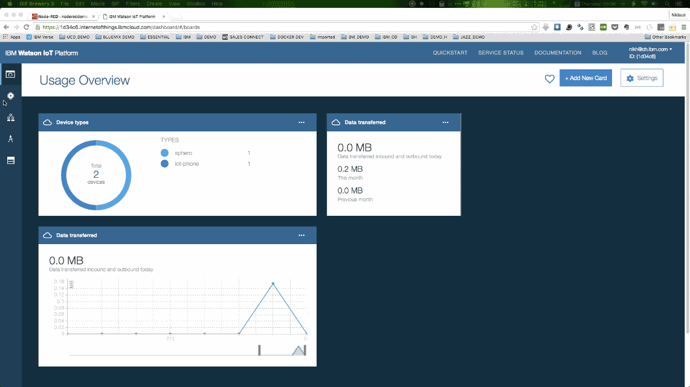
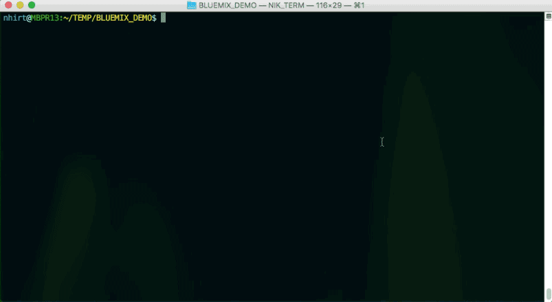
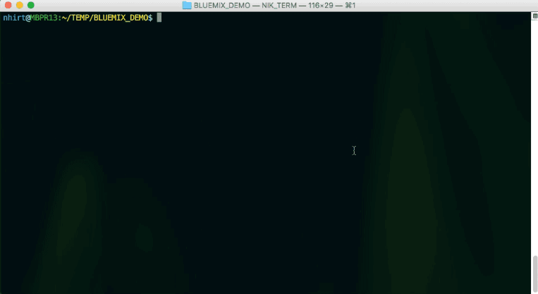
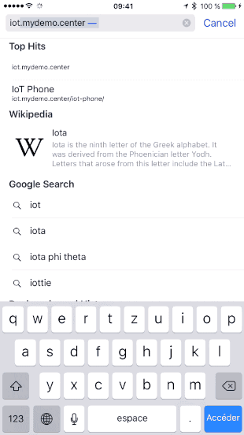

# Sample code to control a BB-8 Droid from a Smartphone


This is a sample project to control a BB-8 Droid based on the works of [shamimshossain](https://github.com/shamimshossain/bb8-bluemix)
using MQTT, the [IBM internet of Things Foundation](http://www.ibm.com/cloud-computing/bluemix/solutions/iot/), and the [sphero.js](https://github.com/orbotix/sphero.js),
. This project also uses the MQTT wrapper from the [parrot-sample](https://github.com/IBM-Bluemix/parrot-sample).

You can control movement of the droid using a Node-RED flow. A sample flow has been included below. 





# Running The Sample

## Hardware

You will require the following devices for this demo.

1. A BB-8 Droid
2. A laptop which supports BLE. The BB-8 will be connected to the laptop via BLE. BB-8 controller code will run on the laptop. I used a MacBook Pro (Retina, 15-inch, Mid 2014).

The laptop will be working as the IoT gateway to connect to BB-8 and receiving the MQTT commands. Here the gateway subscribes to `iot-2/cmd/run/fmt/json` topic.


## Getting The Code

`$ git clone https://github.com/niklaushirt/bb8_demo.git`

## Pre-requisite tasks
### Create and configure the IOT Foundation 
Create an instance of Internet of Things Foundation from Bluemix catalog and name it `IOT Foundation` for example.


From IoTF Dashboard, perform the following tasks.

1. Click the Devices tab and click Add Device.
2. Create a new Device Type called "sphero".  
3.  In the Device ID field enter a unique ID for your drone (for example "my_little_sphero".
4. Click Continue

At the completion of these steps you will see information about the device you registered.  Make note of the auth-token field as you will need that to run the sample.

**The IoTF service can not retrieve these authentication details for you later. So make sure to store these in a secure place**

Next get API keys for your application.

1.  Click on the API Keys tab
2.  Click the New API Key link
3.  You will see a Key and Auth Token displayed.

Take note of the Key and the Auth Token as you will need these to run the sample.

**The IoTF service can not retrieve these authentication details for you later. So make sure to store these in a secure place**

### Update the configuration file 

In the root of the repository you cloned you will find a file named `sphero-config.properties`.  Following is the content of the properties file.

```
#Device ID you use when you register with the IoT foundation
deviceid=yourdroneid

#For controller (device)
authtoken=yourauthtoken
#For the app (publisher)
apikey=yourapikey
apitoken=yourapitoken
```

Replace the values of the deviceid, authtoken, apikey, and apitoken with the values you got when creating the device and app in the IoT Dashboard.

Following is a screenshot of IoTF dashboard.


### Modify the BLE ID



The BB-8 and Ollie use a Bluetooth Low Energy (LE) interface, also known as "Bluetooth Smart" or "Bluetooth 4.0/4.1". You must have a hardware adapter that supports the Bluetooth 4.x+ standard to connect your computer to your BB-8 or Ollie.

Run the following command:

    $ npm install sphero noble
    
To connect to your BB-8, you need to determine its UUID. Once you have Noble installed, you can call `advertisement-discovery.js` to determine the device's UUID:

```
$ node ./node_modules/noble/examples/advertisement-discovery.js
peripheral discovered (944f561f8cf441f3b5405ed48f5c63cf with address <unknown, unknown>, connectable true, RSSI -73:
    hello my local name is:
        BB-131D
    can I interest you in any of the following advertised services:
        []
    here is my manufacturer data:
        "3330"
    my TX power level is:
        -18
```

Look for a local name bit BB-XAZ. In the above output, the device UUID is `944f561f8cf441f3b5405ed48f5c63cf`.

Open the spheroDemo.js file and replace the BLE key you got in the previous step.


## Set up the bridging application to run from your laptop




1. Open a terminal window and make sure you are in the bb8-bluemix directory. Otherwise `cd bb8-bluemix` to the root of the repository.
2. Run `npm install` to install all the dependencies.
2. Place your BB-8 near your BLE compatible laptop.
3. Now start up the controller code by running `node spheroDemo.js`

4. Your BB-8 droid will be connected to IoTF via BLE compatible laptop and change color to green. You will see an output similar to following  from the terminal.
```
**** Start debug info *****
Connected to BB-8
BB-8 is changing color to green to indicate that it is connected
**** End debug info *****
r6co3p.messaging.internetofthings.ibmcloud.com
Output of ping command
{ sop1: 255,
  sop2: 255,
  mrsp: 0,
  seq: 0,
  dlen: 1,
  data: <Buffer >,
  checksum: 254 }
End of ping data
MQTT client connected to IBM IoT Cloud.
Connected Sphero ID: spheroownedbyshamim
subscribed to iot-2/cmd/run/fmt/json
```
5. You are now ready to create an Node-RED Starter app from Bluemix catalog.


## Node-RED


1. Bind the IoTF service created before to this app. The resultant application dashboard looks like the diagram above.
2. Now copy the Node-RED flow from NodeRed/NORDERED.json and import into Node-RED.

Once you have imported the flow you will need to double click on the IBM IoT output node to open the configuration properties and replace the device ID with the device ID you registered your drone with in Bluemix. For example, replace `my_little_sphero ` with your deviceid.


## Mobile App



Make sure you have installed the CloudFoundry command line.

Make sure the the IOT Foundation name in the manifest.yml and app.js file (line 21) correspond to the name you have given your IOT service created earlier.

Open a Teminal and cd into the Mobile_Web_App folder and type:

1. cf api https://api.ng.bluemix.net 
2. cf login -u yourBluemixID -o yourBluemixID -s dev
3. cf push

Now go to the app's URL with your phone (for example http://iot.mybluemix.net/iot-phone/) enter a device name (I use `demo` otherwise you'll have to update it in the NodeRed `FROM iPhone` Node ) and a password (remember this, as you won't be able to change it afterwards!).
Be aware that both are case sensitive!

Now you should can activate the debug nodes in NodeRed and you should get some data streaming through your flow when you move the phone.
And if all is well setup your bb8 should start rolling...

Happy demoing...